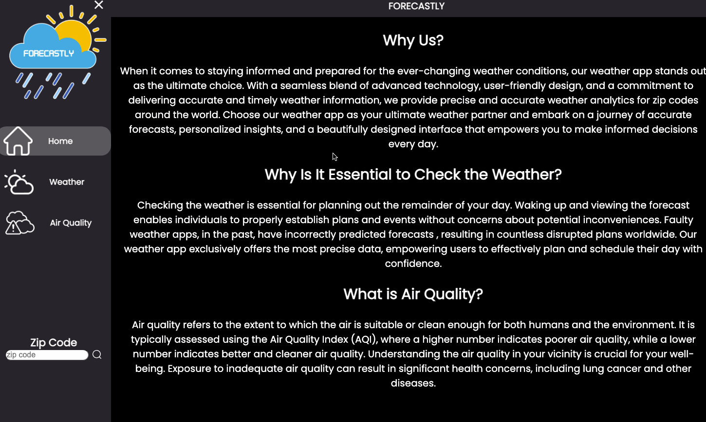

# Weather App

This is a project created by All-Star Code team and I for our final project of the summer intensive course. It is a weather app using WeatherAPI and HTML, CSS, and JavaScript. 

<a href="https://majesticfelix.github.io/Demo-Day-Project/">Link to Website</a>

## Video Walkthrough

Here's a walkthrough of implemented features:

GIF created with LICEcap
